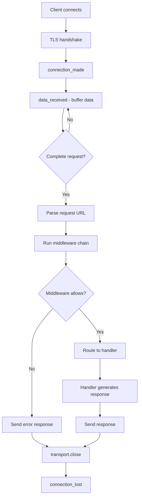
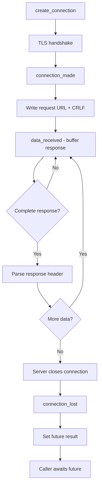

# Architecture

This document explains the design decisions and architecture of nauyaca, a Gemini protocol implementation in Python. Understanding these choices will help you appreciate why the code is structured the way it is and how to effectively extend it.

## Why asyncio.Protocol/Transport?

Nauyaca uses Python's low-level `asyncio.Protocol` and `asyncio.Transport` pattern instead of the higher-level Streams API (`asyncio.open_connection()` / `StreamReader` / `StreamWriter`). This decision is fundamental to the project's architecture.

### The Callback-Based Design

The Protocol/Transport pattern is **callback-based** rather than async/await-based:

```python
class GeminiServerProtocol(asyncio.Protocol):
    def connection_made(self, transport):
        """Called when connection established - not async"""
        self.transport = transport

    def data_received(self, data):
        """Called when data arrives - not async"""
        self.buffer += data

    def connection_lost(self, exc):
        """Called when connection closes - not async"""
        self.cleanup()
```

These methods are **synchronous callbacks** invoked by the event loop. This design has several advantages:

### Performance Benefits

1. **Lower Overhead**: No async/await context switching overhead. Callbacks execute directly in the event loop.

2. **Efficient Buffering**: Direct control over buffering means you can optimize memory usage and avoid unnecessary copies.

3. **High Throughput**: Better for servers handling many concurrent connections. Each connection's callbacks are lightweight.

### Control Benefits

1. **Fine-Grained Flow Control**: Access to `pause_writing()` and `resume_writing()` for backpressure handling when serving large files.

2. **Connection Lifecycle**: Explicit hooks for every phase of connection lifecycle (established, data, EOF, closed).

3. **Buffer Management**: Complete control over how you accumulate and process incoming data.

### Protocol-Oriented Design

The Protocol/Transport pattern naturally fits protocol implementations:

- **Protocols are state machines**: Each connection has state (buffering partial data, rate limiting, etc.)
- **Transports are I/O primitives**: Write bytes, close connection, get peer info
- **Clear separation**: Protocol logic separate from I/O mechanism

### Trade-offs

The main trade-off is complexity: callback-based code is harder to reason about than linear async/await code. We bridge this gap with `asyncio.Future` when needed:

```python
# In high-level async code:
loop = asyncio.get_running_loop()
result_future = loop.create_future()

# Create connection with protocol
transport, protocol = await loop.create_connection(
    lambda: GeminiClientProtocol(result_future),
    host, port, ssl=ssl_context
)

# Protocol sets result when done:
def connection_lost(self, exc):
    if not self.result_future.done():
        self.result_future.set_result(self.response)

# Back in async code:
response = await result_future  # Bridged to async/await
```

This pattern lets us keep high-level APIs clean while maintaining low-level performance.

## Module Structure

Nauyaca is organized into six top-level packages, each with clear responsibilities:

```
src/nauyaca/
├── protocol/     # Core protocol types (request, response, status codes)
├── server/       # Server implementation (protocol, handlers, routing, middleware)
├── client/       # Client implementation (protocol, session, high-level API)
├── security/     # TLS configuration, certificates, TOFU
├── content/      # Gemtext parsing, MIME detection, templates
└── utils/        # URL parsing, logging, helpers
```

### protocol/ - Core Protocol Types

The `protocol/` package contains **protocol-agnostic** definitions:

- `constants.py`: Status codes, MIME types, protocol limits (1024 byte request limit)
- `status.py`: `StatusCode` enum with semantic methods (`is_success()`, `is_redirect()`)
- `request.py`: `GeminiRequest` - URL parsing, validation, normalization
- `response.py`: `GeminiResponse` - Response building, header formatting

These types are used by **both** server and client. They encode the Gemini specification without assuming which side you're on.

**Design decision**: Separating protocol types from implementation lets us:
- Test protocol logic independently
- Reuse validation code between server and client
- Swap out server/client implementations without changing protocol types

### server/ - Server Implementation

The `server/` package implements the server side:

- `protocol.py`: `GeminiServerProtocol(asyncio.Protocol)` - connection handling, request parsing
- `handler.py`: `RequestHandler` base class, `StaticFileHandler`, future `CGIHandler`
- `router.py`: URL pattern matching, route registration to handlers
- `middleware.py`: Rate limiting, access control, request filtering
- `config.py`: `ServerConfig` with TOML configuration support
- `server.py`: High-level server startup functions

**Layering**: The server has three layers:

1. **Protocol layer** (`protocol.py`): Manages TLS connection, buffers data, parses request
2. **Middleware layer** (`middleware.py`): Filters/validates requests before they reach handlers
3. **Application layer** (`handler.py`, `router.py`): Business logic - what response to send

This separation allows:
- Testing each layer independently
- Swapping middleware without touching protocol code
- Adding new handler types without modifying protocol parsing

### client/ - Client Implementation

The `client/` package implements the client side:

- `protocol.py`: `GeminiClientProtocol(asyncio.Protocol)` - connection handling, response parsing
- `session.py`: `GeminiClient` - high-level async API, TOFU integration, redirect following

The client is simpler than the server (no routing or middleware), but includes important security:

- **TOFU validation**: Certificate fingerprinting and trust-on-first-use checking
- **Redirect loop detection**: Maximum 5 redirects to prevent infinite loops
- **Rate limit respect**: Handles status 44 (SLOW DOWN) responses

### security/ - Security Primitives

The `security/` package centralizes all security concerns:

- `tls.py`: SSL context creation with correct TLS 1.2+ configuration
- `certificates.py`: Certificate generation, loading, fingerprinting (SHA-256)
- `tofu.py`: SQLite-backed TOFU database, certificate validation, import/export

**Why separate?** Security is critical and needs focused attention. By isolating it:
- Security code is easier to audit
- TLS configuration is consistent across server and client
- TOFU implementation can be swapped out (e.g., for Redis-backed storage)

### content/ - Content Handling

The `content/` package handles content types:

- `gemtext.py`: Gemtext parser/renderer, line type detection, directory listing generation
- `templates.py`: Error page templates, directory listing templates

**Design decision**: Content handling is separate because:
- Gemtext parsing is complex enough to deserve its own module
- Templates might be user-customizable in the future
- Adding new content types (e.g., Markdown rendering) is easier

### utils/ - Shared Utilities

The `utils/` package contains helpers used across multiple packages:

- `url.py`: URL parsing, validation, normalization (handles `gemini://` scheme)
- `logging.py`: Logging configuration and formatters

## Request/Response Flow

Understanding the data flow through nauyaca helps you know where to hook in custom logic.

### Server Request Flow



**Key points**:

1. **Buffering**: `data_received()` may be called **multiple times** for a single request. Always buffer until you see `\r\n`.

2. **Middleware runs first**: Before routing, middleware can reject requests (rate limiting, IP filtering, certificate validation).

3. **One request per connection**: Gemini mandates closing the connection after each response. No keep-alive.

4. **Transport writes**: The protocol writes bytes to the transport, which handles actual network I/O.

### Client Request Flow



**Key points**:

1. **Future-based**: Client protocol uses `asyncio.Future` to bridge callbacks to async/await.

2. **Server controls closure**: Server always closes connection. Client detects this in `connection_lost()`.

3. **Response may be chunked**: Large responses arrive in multiple `data_received()` calls. Buffer until connection closes.

4. **TOFU validation**: After TLS handshake, check certificate fingerprint against database.

## Middleware Architecture

Nauyaca uses a **chain of responsibility** pattern for middleware.

### Middleware Protocol

All middleware implements the `Middleware` protocol:

```python
class Middleware(Protocol):
    async def process_request(
        self,
        request_url: str,
        client_ip: str,
        client_cert_fingerprint: str | None = None,
    ) -> tuple[bool, str | None]:
        """
        Returns:
            (True, None) - allow request to proceed
            (False, gemini_response) - reject with response
        """
        ...
```

This simple interface lets any component decide whether to allow a request.

### Middleware Chain

Multiple middleware are composed into a chain:

```python
class MiddlewareChain:
    def __init__(self, middlewares: list[Middleware]):
        self.middlewares = middlewares

    async def process_request(self, request_url, client_ip, client_cert_fp):
        for middleware in self.middlewares:
            allow, response = await middleware.process_request(
                request_url, client_ip, client_cert_fp
            )
            if not allow:
                return False, response  # First rejection wins
        return True, None  # All middleware allowed
```

**Execution order matters**: Middleware runs in the order registered. Typically:

1. **Rate limiting** first (reject quickly to save resources)
2. **IP access control** second (deny/allow lists)
3. **Certificate validation** third (for paths requiring client certs)
4. **Custom middleware** last

### Built-in Middleware

Nauyaca provides three middleware out of the box:

**RateLimiter** - Token bucket algorithm per IP:
```python
rate_limiter = RateLimiter(
    config=RateLimitConfig(capacity=10, refill_rate=1.0)
)
# Allows burst of 10 requests, then 1 per second
```

**AccessController** - IP allow/deny lists with CIDR support:
```python
access_control = AccessController(
    allow_list=["192.168.1.0/24"],
    deny_list=["10.0.0.5"]
)
```

**ClientCertificateMiddleware** - Require client certificates for paths:
```python
cert_middleware = ClientCertificateMiddleware(
    required_paths=["/admin", "/private"]
)
```

### Why Middleware?

The middleware pattern provides several benefits:

1. **Composability**: Mix and match security features without modifying server code.

2. **Testability**: Each middleware can be unit tested independently.

3. **Order control**: You decide which checks run first (important for performance).

4. **Extensibility**: Add your own middleware without touching nauyaca's code.

### Example: Custom Middleware

Here's how to write custom middleware:

```python
class PathBlockerMiddleware:
    """Block requests to specific paths."""

    def __init__(self, blocked_paths: set[str]):
        self.blocked_paths = blocked_paths

    async def process_request(
        self, request_url: str, client_ip: str, client_cert_fp: str | None
    ) -> tuple[bool, str | None]:
        from urllib.parse import urlparse

        path = urlparse(request_url).path
        if path in self.blocked_paths:
            return False, "51 Not Found\r\n"

        return True, None

# Use it:
middleware_chain = MiddlewareChain([
    RateLimiter(),
    PathBlockerMiddleware({"/secret", "/hidden"}),
])
```

## Extension Points

Nauyaca is designed to be extended without modifying core code. Here are the main extension points:

### Custom Handlers

The most common extension is adding new request handlers:

```python
from nauyaca.server.handler import RequestHandler
from nauyaca.protocol.request import GeminiRequest
from nauyaca.protocol.response import GeminiResponse

class DynamicContentHandler(RequestHandler):
    """Generate dynamic content based on request."""

    def handle(self, request: GeminiRequest) -> GeminiResponse:
        # Your logic here
        content = self.generate_content(request)
        return GeminiResponse.success(content, mime_type="text/gemini")

    def generate_content(self, request: GeminiRequest) -> str:
        # Generate gemtext based on request
        return f"# Dynamic Page\n\nYou requested: {request.path}"

# Register with router:
router = Router()
router.register(r"^/dynamic/.*", DynamicContentHandler())
```

**When to use**: Any time you need to generate content programmatically instead of serving static files.

### Custom Middleware

As shown above, middleware is the extension point for request filtering:

```python
class LoggingMiddleware:
    """Log all requests."""

    async def process_request(
        self, request_url: str, client_ip: str, client_cert_fp: str | None
    ) -> tuple[bool, str | None]:
        import logging
        logging.info(f"{client_ip} -> {request_url}")
        return True, None  # Always allow
```

**When to use**: Authentication, authorization, logging, metrics, custom rate limiting.

### TOFU Callbacks

The TOFU implementation supports callbacks for certificate events:

```python
from nauyaca.security.tofu import TOFUDatabase

def on_new_certificate(hostname: str, port: int, fingerprint: str):
    """Called when seeing a host for the first time."""
    print(f"New host: {hostname}:{port}")

def on_certificate_change(hostname: str, port: int, old_fp: str, new_fp: str):
    """Called when a known host's certificate changes."""
    print(f"Certificate changed for {hostname}:{port}")
    # Could send alert, log to security system, etc.

db = TOFUDatabase(
    db_path="tofu.db",
    on_new_certificate=on_new_certificate,
    on_certificate_change=on_certificate_change,
)
```

**When to use**: Security monitoring, alerting, custom trust policies.

### Configuration Extension

Server configuration uses Python dataclasses and can be extended:

```python
from dataclasses import dataclass
from nauyaca.server.config import ServerConfig

@dataclass
class ExtendedConfig(ServerConfig):
    """Add custom configuration fields."""
    enable_metrics: bool = False
    metrics_port: int = 9090

    @classmethod
    def from_toml(cls, path: str):
        # Load base config
        base = super().from_toml(path)

        # Add your custom fields from TOML
        # ...

        return cls(**base.__dict__, enable_metrics=True)
```

**When to use**: Adding new server features that need configuration.

## Design Principles

Understanding these principles helps you work with nauyaca's architecture:

### 1. Protocol Correctness

Gemini has a simple but **strict** specification. Nauyaca prioritizes correctness:

- Always use `\r\n` (CRLF) for line endings
- Enforce 1024 byte request limit
- Require TLS 1.2+ minimum
- Close connection after each response
- Validate UTF-8 encoding

**Rationale**: A protocol implementation must be correct before it's fast or feature-rich.

### 2. Security by Default

Security features are **enabled by default** where possible:

- TLS is mandatory (no plaintext mode)
- Path traversal protection in `StaticFileHandler`
- Request size limits enforced
- TOFU validation in client
- Rate limiting available out of the box

**Rationale**: Users shouldn't have to remember to enable security.

### 3. Explicit Over Implicit

Nauyaca favors explicit code over magic:

- Middleware order is explicit (not auto-sorted)
- Route registration is explicit (not auto-discovered)
- Configuration is explicit (not convention-based)

**Rationale**: When debugging, explicit code is easier to trace and reason about.

### 4. Test-Driven Architecture

The architecture is shaped by testing needs:

- Protocol types are separate (easy to test without network)
- Handlers are dependency-injected (easy to mock)
- Middleware uses `async def` (easy to test with pytest-asyncio)

**Rationale**: If it's hard to test, it's probably poorly designed.

## Common Patterns

Here are patterns you'll see throughout the codebase:

### Pattern: Data Buffering

Because `data_received()` can be called multiple times, **always buffer**:

```python
def __init__(self):
    self.buffer = b""

def data_received(self, data: bytes):
    self.buffer += data

    if b'\r\n' in self.buffer:
        line, self.buffer = self.buffer.split(b'\r\n', 1)
        self.process_line(line)
```

**Why**: Network data arrives in unpredictable chunks. Buffering ensures you process complete messages.

### Pattern: Future Bridging

To use callback-based protocols from async code:

```python
# Create future in async context
loop = asyncio.get_running_loop()
future = loop.create_future()

# Pass to protocol
protocol = MyProtocol(future)

# Protocol sets result in callback
def connection_lost(self, exc):
    self.future.set_result(self.data)

# Await in async context
result = await future
```

**Why**: Bridges the gap between callback world (protocol) and async/await world (application).

### Pattern: Fail-Fast Validation

Validate input as early as possible:

```python
def handle(self, request: GeminiRequest) -> GeminiResponse:
    # Validate first
    if not request.path:
        return GeminiResponse.bad_request("Path required")

    # Then process
    return self.process_request(request)
```

**Why**: Failing fast prevents wasted work and makes debugging easier.

### Pattern: Context Managers for Cleanup

Use context managers for resources that need cleanup:

```python
async with TOFUDatabase("tofu.db") as db:
    is_valid = await db.verify_certificate(host, port, cert)
    # Database automatically closed when context exits
```

**Why**: Ensures cleanup happens even when exceptions occur.

## See Also

- [API Reference: Server Protocol](/reference/api/server/protocol/) - Technical details of `GeminiServerProtocol`
- [API Reference: Middleware](/reference/api/server/middleware/) - Complete middleware API
- [How-To: Write Custom Middleware](/how-to/custom-middleware/) - Step-by-step guide
- [How-To: Create Custom Handlers](/how-to/custom-handlers/) - Handler development guide
